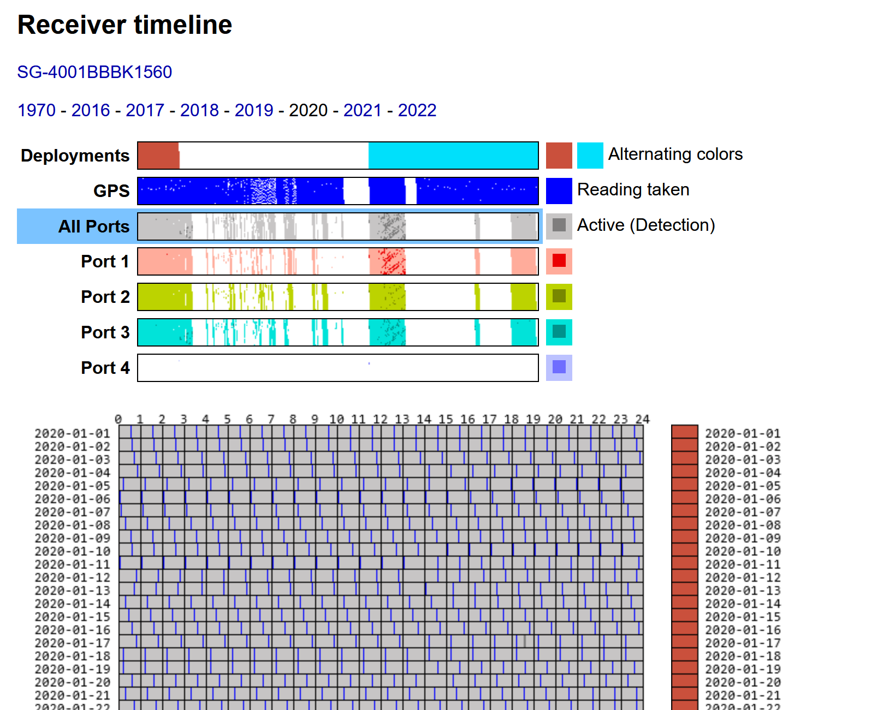

# Detection timelines

## Type of timelines

Listed below are a few timelines available on the Motus website, each serving a different purpose.&#x20;

### **Receiver timeline**

A detailed plot of hourly GPS hits, antenna pulses, and unfiltered tag detections for a given _receiver serial number_.&#x20;

#### Useful for

* Observing diurnal changes in detections.
* Looking for specific times when data gaps occur.

**Where to find this plot**

Only available to project managers. Go to: Manage Data -> Manage Stations and select one of the stations from the map or table. In the details pane on the right, click on '**receiver timeline**' under the deployment of interest. This plot can be accessed in a similar manner from the Receiver Management page.

#### How to use this plot

* The top of the page shows a summary of detections (GPS hits and antenna pulses) as well as deployments in alternating colours.&#x20;
  * Clicking one of the summary plots switches the main plow between individual antenna ports or all ports at once.
* On the larger plot hours are plotted on the X axis and days are plotted on the Y axis and GPS hits/pulses/tag hits are represented as shaded vertical lines:
  * Blue lines are GPS hits (typically 1 per hour)
  * Light grey lines are antenna pulses
  * Dark grey lines are unfiltered tag detections.
* Deployments are also desplayed alongside the main plot in a similar manner to the summary plots, as alternating colours.

### **Deployment timeline**

A large plot of hourly GPS hits, antenna pulses, and unfiltered tag detections for a given _station deployment._&#x20;

#### Useful for

* Looking in the unfiltered data for missing tag detections&#x20;
* Looking for tag aliasing events
* Looking for false positives as a result of noise events

**Where to find this plot**

Only available to project managers. Go to: Manage Data -> Manage Stations and select one of the stations from the map or table. In the details pane on the right, click on '**deployment timeline**' under the deployment of interest. This plot can be accessed in a similar manner from the Receiver Management page.

.png>)

#### How to use this plot

* Time is plotted on the X axis and each tag or device (gps/antenna) are plotted as a categorical variable on the Y axis.&#x20;
* The top row on this plot is the 'reboot odometer' which keeps track of each time the receiver restarts.&#x20;
* Antenna pulses are only present for antennas on Lotek frequencies since CTT antennas do not record such data. For this reason, only test tags can be used to verify CTT antennas are functional.
* Tag hits are recorded as circles, but the circles are not centered on the time that the detection occurs, rather it's the circle's left edge which corresponds to the time of detection.
* Tags are labeled the following way: \
  `[project short name]#[manufacturer tag ID]:[burst rate] M.[Motus tag ID]`

### **Station timeline**

An interactive plot of daily GPS hits, antenna pulses, and filtered tag detections at a given station. Time is plotted on the X axis and each tag or device (gps/antenna) are plotted as a categorical variable on the Y axis. Data are represented as coloured bars with the intensity increasing with the count of detections for that given variable. An additional row on the top of the plot displays the deployment periods as coloured boxes (colour of box changes with each deployment).

#### Useful for

* Checking when the station was functional
* Identifying noisy antennas
* Looking for noise events which may have resulted in false positives

**Where to find this plot**

This plot is available in the public data under explore data after any station has been selected. On a station summary page, click on the 'Status' tab next to the 'map' tab.

.png>)

#### How to use this plot

* There are two parts: the main plot on top and the smaller 'brush' plot on the bottom for navitagion.&#x20;
* On the main plot you can zoom in and out (scroll the mouse wheel) and click and drag your mouse to move it horzontally.&#x20;
* Hovering your mouse over the main plot gives you specific numbers for each variable on the day your hovered over.&#x20;
* The 'brush' plot is used to more quickly zoom into specific areas of the plot. This can be done by clicking and draging on the plot to draw a box around the data you wish to zoom into.&#x20;
  * Once the plot is zoomed in, you can click and drag this box to move it around.
