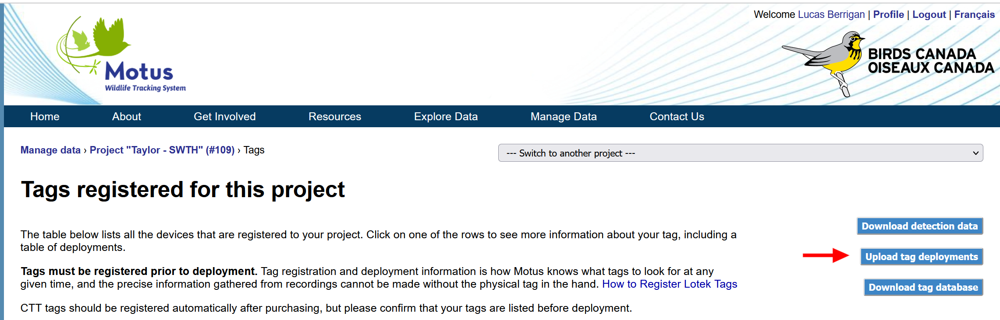

# Tag Management


**This chapter is in development**


This section pertains to the management of tag metadata: i.e., the registration of tags and their deployments. To learn more about tags models and how to deploy them, see our chapter on tags:


[broken-reference](broken-reference/)


In this chapter you will find:

* [**Definition of Tags and Tag Deployments**](./#introducing...stations)
* [**How to Manage Tags**](./#managing-tags)
* [**Tag Registration**](tag-registration.md)
* [**Tag Metadata**](tag-metadata.md)

## Definitions

#### Tags

Tags are the individual radio transmitters compatible with Motus which are manufactured by either CTT or Lotek. They each have a digitally encoded ID (manufacturer ID), a burst rate (a.k.a., 'burst interval' or 'period'), and a model.

**Tag deployments**

A deployment is condsidered to be each instance when a tag was attached to animal and then released. Most tags are never recovered therefore most tags have only one deployment. Tag deployments record all the information regarding the animal that it was attached to, including: date/time of release, location of deployment, species, age, sex, weight, and any other metrics that can be provided.

## Managing Tags

Every time a Motus tag is deployed, this needs to be recorded in our database, otherwise there may be missing detections. This section covers the following topics:

* [**Tag Registration**](./#tag-registration)
* [**Tag Deployments**](./#tag-deployments)
  * [Anticipated deployments](./#undefined)
  * [Test deployments](./#undefined)
  * [Tag Deployment Bulk Editor](./#tag-deployment-bulk-editor)

### Tag Registration

All tags are automatically registered to your Motus project before shipment, regardless of the manufacturer (CTT or Lotek). However, you must tell the manufacturer your the Motus project ID for them to register the tag to the correct project. For more information, see [**Tag Registration**](tag-registration.md).

### Tag Deployments

A deployment is a single instance where a tag was attached to an animal ([or was used in a "tag test"](../../stations/station-inspection/tag-test.md)). The deployment begins when the animal is released. The deployment ends either: automatically (Motus calculates when the tag is expected to expire based on the tag model); or manually (when a collaborator recovers the tag from the animal).

Deployments are a necessary way for Motus to efficiently search for tag IDs within radio data. Without tags deployments, data will be missing.


Most Motus tags are never recovered so ending tag deployments is usually unnecessary.


#### Anticipated deployments

While tag deployments are necessary for detections to occur, it is impractical to register deployments immediately after each one is deployed. _Anticipated deployments_ are essentially placeholders or real deployments and begin on the earliest date which tags expect to be deployed.


You must still confirm anticipated deployments after the anticipated date has passed by updating the tag deployment metadata. For more information about anticipated deployments, see [**Tag Metadata**](tag-metadata.md#anticipated-deployment-date).



**Example 1**\
\
Laura wants to deploy 50 tags on Bank Swallows in the summer of 2022. She anticipates to be in the field by June 10th, at the earliest. Using the [bulk editor](./#tag-deployment-bulk-editor), she registers deployments for all 50 tags with a start date of **`2022-06-10`** and with the species **`Riperia riperia`**. Over the course of the field season, she ends up deploying 47 of her tags and stores 3 of them for later use. Shortly after her field season is complete, she goes back to her Motus project's tag management page to correct the deployment start dates and fill in the rest of the metadata for each of her tags. With the 3 tags that she stored for later use, she removes the start dates and species using the bulk editor.


#### Test deployments

Tags can be used to test whether a receiver or specific antennas are functioning as expected. However, we don't want these data to be included in analyses of animal movements, nor do we want them presented to the public since it can be confusing. To flag these deplyoments as test, check the box reading 'make this a test deployment' while registering your tag deployment and leave the 'Species' field blank.

<figure><figcaption></figcaption></figure>


[tag-test.md](../../stations/station-inspection/tag-test.md)


#### **Tag deployment b**ulk editor

Multiple tag deployments can be registered and/or modified at once using the tag deployment bulk editor. This can be found by clicking on "[**Upload tag deployments**](https://motus.org/data/project/tags/template)" under Tag Management. Follow the instructions on the page to upload tag deployments.

