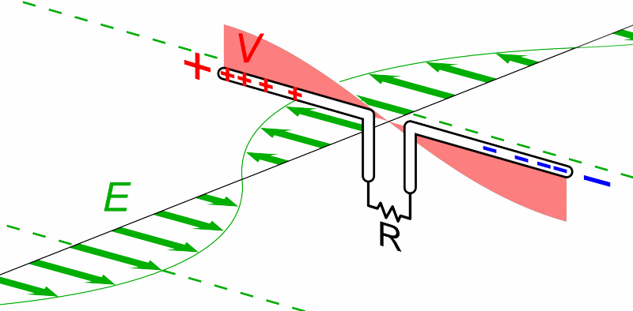

# Antennas, Cables, and Dongles

## How to select an antenna

It is very important you select the right antenna for the purpose of the station and the type of tags you intend to detect. Antennas are optimized for reception on a particular radio frequency. Since there are multiple tag frequencies, each tag type requires its own antenna; currently an antenna optimized to detect Lotek tags on 166.380 Mhz will not detect CTT tags on 434 Mhz, and vice versa. Wherever possible we recommend installing “dual-mode” stations outfitted with antennas and a receiver that can detect both tags. A dual-frequency antenna is under development, but for the time being, dual-mode stations (those that can listen for more than one frequency, must have two different types of antenna in place.

### How antennas work

An antenna is a device used to send or receive radio signals, i.e., electromagnetic radiation. This radiation induces a voltage in conductive materials which will vary in magnitude based on the physical dimensions and orientation of the material. The induced voltage oscillates at the same frequency as the electromagnetic radiation and the magnitude of the voltage is proportional to the strength of the radiation. Antennas used in the Motus Network are built (“tuned”) with high precision such that the induced voltage is greatest when exposed to the narrow range of frequencies that Motus tags emit. Antennas can also be shaped to select for radiation from specific directions and orientations.

Each antenna has a theoretical radiation pattern which represents its range in 3D space. We use the radiation pattern to predict the distance and direction in which we can receive signals from radio transmitters. Omnidirectional (‘omni’) antennas, as the name suggests, have a uniform radiation pattern that is emitted perpendicular to its axis. The thin wire attached to Lotek and CTT tags is a type of omni antenna. When used on a receiver, omni antennas provide presence/absence information, typically within a short range. This makes them ideal for fine scale studies as demonstrated with CTT SensorNodes which can be used to create a high-resolution grid of stations.

 

_**Left:** A torus, representing the electromagnetic radiation pattern of an omnidirectional antenna (_[_CC BY-SA 3.0_](https://creativecommons.org/licenses/by-sa/3.0)_, source:_ [_Wikipedia_](https://commons.wikimedia.org/wiki/File:Simple\_Torus.svg)_). **Right:** Cross-sectional view of a half-wave omni-directional antenna (public domain, source: Wikipedia)._

Yagi-Uda (‘Yagi’) antennas are a type of directional antenna that are the most commonly used antenna in the Motus network. Their radiation pattern is directed into a beam which varies in length and width based on the number of ‘directing elements’ with a greater number of elements resulting in a longer, narrower beam. For example, a 9-element Yagi antenna can theoretically provide tag detections from 15 km away at 166.380 MHz, but in reality this will vary widely based on the landscape and atmospheric conditions. Yagi antennas are favorable for most applications since they can be used to create receiver ‘fences’ or ‘grids’ with fewer stations than an omni antennas could. In addition, multiple Yagi antennas on a single station can be used to infer flight direction based on the timing of detection across each antenna.

A variety of antenna options exist for VHF/UHF telemetry. To date, collaborators have used 3, 5, 6, and 9-element Yagi directional antennas, and omni-directional antennas. Generally the greater the number of elements, the longer the detection range and more narrow the detection beam. The fewer the elements, the shorter the detection range, but the broader the detection beam. Omni-directional antennas are best suited for determining species presence-absence patterns (e.g. seabirds at a colony), or for detecting birds in close proximity to stations (within a few hundred metres), not suited for providing directional information (e.g. departure directions of songbirds from a stopover site).

Large Yagi antennas are useful for making receiver fences and grids since they can be spaced as far as 30 km apart with antennas pointing towards each other to capture animals passing in between. Mid-sized Yagi antennas provide a compromise between distance and “field of view”, or width of the detection beam. Small Yagi antennas are typically used for manual tracking, or for monitoring animals within a small study area. [CTT Nodes](https://celltracktech.com/products/tag-system/ctt-node/) have small omni antennas with a line-of-sight (LOS) range of around 1.4 km which if distributed in a grid can provide highly accurate location estimates. See array design above.

### Ordering Antennas

When ordering antennas and cables, it is important to ensure:

1. Connectors between the coaxial cable, antennas, and receiver are compatible.
2. The impedance rating of all cables, connectors, and dongles are the same (50 Ohms).
3. Cable type is suitable for the length needed.
4. Get recommended equipment if inexperienced with the technology (highlighted in green).

Select an item from the list below to learn more:

* [Antennas](antennas.md#antenna-types)
* [Coaxial Cables](antennas.md#coax-cables)
* [Radio Dongles](antennas.md#radio-dongles)
* [Connectors](antennas.md#connectors)

### Antenna Anatomy

### **Yagi-uda**

This antenna, usually referred to as simply “Yagi” or more generally a directional antenna.


The image below shows the antenna in vertical orientation for illustrative purposes; however, antennas are typically mounted in a **horizontal orientation** (i.e., antenna elements are pointed horizontally) and we recommend you do the same for consistency. [See antenna orientation for more information](../station-installation/#antenna-orientation).


### Antenna Types

A variety of antenna options exist for VHF telemetry. To date, users have used 3, 5, 6, and 9-element Yagi directional antennas, and single-pole omni-directional antennas. The 9-element Yagis have a long, narrow detection range, whereas 3, 5, or 6-element Yagis have gradually shorter and wider detection ranges. Omni-directional antennas are best suited for determining species presence-absence patterns (e.g. seabirds at a colony), or for detecting birds in close proximity to stations (within a few hundred metres), but not for providing directional information (e.g. departure directions of songbirds from a stopover site).

When ordering antennas, it’s important to know what frequency you need it to be tuned to. For detecting Lotek tags, antennas must be tuned to 150.1 MHz (Europe), 151.5 MHz (Australia), or 166.380 MHz (Western Hemisphere), depending on the region. For detecting CTT tags, antennas must be tuned to 434 MHz.

Antennas can be purchased from the following suppliers:

* [Laird](https://www.arcantenna.com/plc1669-laird-yagi-heavy-duty-9-element-antenna-for-166-174-mhz-with-uhf-female-connector-track-migratory-birds.html) (through Hutton in Canada Economy 2-way in US)
* Wade Antenna \[LINK]
* [Maple Leaf Communications](http://www.mapleleafcom.com)
* [Digikey](http://www.mapleleafcom.com)

Use the table below to help select your antenna:

| **Antenna type**                                                 | **Typical price (USD)** | **Impedence** | **Theoretical range** | **View**           |
| ---------------------------------------------------------------- | ----------------------- | ------------- | --------------------- | ------------------ |
| <mark style="background-color:green;">**3-element Yagi**</mark>  | \$$$                    | 50 Ohms       | \~5 km                | Wide directional   |
| **5-element Yagi**                                               | \$$$                    | 50 Ohms       | \~8 km                | Directional        |
| **6-element Yagi**                                               | \$$$                    | 50 Ohms       | \~10 km               | Directional        |
| <mark style="background-color:green;">**9-element Yagi**</mark>  | \$$$                    | 50 Ohms       | \~15 km               | Narrow directional |
| <mark style="background-color:green;">**Omnidirectional**</mark> | \$$$                    | 50 Ohms       | \~1 km                | Omnidirectional    |
| Items listed in green are recommended.                           |                         |               |                       |                    |

## Coax Cables

Coaxial cables (coax for short) are responsible for carrying the received radio signal from the antennas to the receiver. This cable is so-called coaxial because it contains a central conductor surrounded by a second conductor that runs _coaxial_ to the central conductor (around it). This second conductor is electrically connected to the ground plane and provides shielding that helps insulate the central signal-carrying conductor from external electromagnetic interference and also reduces the amount of energy lost from the central conductor. Between the central core and shielding is a layer of insulating material which can vary in thickness, as well as the plastic outer jacket of the cable.

&#x20;

The signal carried by coax is measured in decibels (dB) and calculated by comparing the power coming out of the coaxial cable to a theoretical 1 mW transmitter.

With this equation in mind you can see how an increase of 3 dB actually means a doubling of the received power. Antenna resistance is an intrinsic property of the antenna and usually runs at 50 Ω. The coaxial cable also has a resistance so it will reduce the power of the incoming signal which varies by frequency. This is known as attenuation.

When selecting coaxial cables, you want pick something that keeps attenuation to a minimum. Attenuation can’t be eliminated entirely, so we try to keep it within a reasonable limit. For weak signal detection a difference 0.2 dB can be significant. The supplier for our coaxial cables and antennas here in Canada (Maple Leaf Communications) has suggested we try to keep attenuation under 1.0 dB for any cable length, but obviously this is not always practical. The recommended low-loss cable is the LMR-400, but it is very bulky and difficult to work with. For this reason, we recommend using lower grade cables for short lengths, such as the LMR-240 or RG-58.

To get an idea of what kind of effect attenuation may have on tag detection, imagine a receiver with a theoretical detection radius of 10 km. If the antennas on the receiver experienced 1.0 dB of attenuation, this radius would be reduced to 9 km; if they experienced 2.5 dB of attenuation, that would be reduced to 7.5 km.

| **Cable type**                                                                                                                                                                                                                                                   | **Typical price (USD)** | **Impedance** | 
<strong>Max attenuation</strong>

<strong>(dB/100 ft)</strong>
 | **Suggested length** |
| ---------------------------------------------------------------------------------------------------------------------------------------------------------------------------------------------------------------------------------------------------------------- | ----------------------- | ------------- | -------------------------------------------------------------------------- | -------------------- |
| [**RG-58**](https://www.pasternack.com/flexible-0.195-rg58-50-ohm-coax-cable-pvc-jacket-rg58c-u-p.aspx)                                                                                                                                                          | < 100 ft. @ $0.83/ft.   | 53.5 Ohms     | 
4.4 @ 100 MHz

6.0 @ 200 MHz

8.5 @ 400 MHz
               | < 50 ft./15 m        |
| [<mark style="color:green;">**RG-213**</mark>](https://www.pasternack.com/flexible-0.405-rg213-50-ohm-coax-cable-pvc-jacket-rg213-u-p.aspx)                                                                                                                      | < 100 ft. @ $1.79/ft.   | 50 Ohms       | 
2.3 @ 100 MHz

4.8 @ 400 MHz
                                   | < 100 ft./30 m       |
| 
<mark style="background-color:green;">TWS/BMR/</mark>

<a href="https://www.pasternack.com/50-ohm-low-loss-flexible-lmr400-pe-jacket-double-shielded-black-lmr-400-P.aspx"><mark style="background-color:green;"><strong>LMR-400</strong></mark></a>
 | $1.20/ft.               | 50 Ohm        | 
1.5 @ 150 MHz

2.7 @ 450 MHz
                                   | Any length           |

#### Signal loss by length of cable

One of our antenna equipment suppliers, Maple Leaf Communications, has written a helpful guidance document for selecting cables based on the length and frequency required.&#x20;



#### Additional documentation

A helpful guide on coaxial cables can be found on the [Wilson Amplifiers website](https://www.wilsonamplifiers.com/blog/understanding-coaxial-cables-the-complete-guide/)

A catalogue of cables and their specifications can be found on [Allied Wire & Cable](https://www.awcwire.com/producttoc.aspx?id=coaxial-cable). But briefly, we use:

* **RG58** – basic communications cable that typically comes with a BNC connector. Best used for lengths less than 50′. The least expensive option.
* **RG213** – higher grade cable that can be used at length of up to 100′ with low signal loss. Custom cable ends depending on distributor/manufaturer. Moderate price.
* **TWS/LMR-400** – similar to the RG-213, but higher quality (stronger weather/sun resistance) coating. Best for longer-term installations and long cable length. Most expensive. Manufacture can suggest which cable is best for your needs – LMR is generally more affordable.
* **BMR-240** - available from Maple Leaf Communications, this cable has slightly less plastic insulation, making it much more flexible and easier to work with than LMR-400, while offering similar attenuation.


**Motus Pro Tip** - The heavier gauge cables can be awkward to work with and difficult to connect inside the receiver. Short jumper cables with smaller gauge can be used to help work in tight spaces. \[MISSING: example photo from Maple Leaf]. However, this does increase the number of connections which may result in a slight decrease in signal strength (see [connectors ](antennas.md#connectors)below).


## Radio Dongles

Radio dongles, also known as Software Defined Radios (SDRs), are used to convert analog signal received by the antennas into a digital signal that can be interpreted by the SensorGnome . Note that Lotek receivers have a built-in converter and do not require these for station operation. Note that SensorStations only need an SDR for antennas tuned for Lotek tags (anything that isn’t 434 MHz).

While there are dozens of available SDR’s on the market, only four models are compatible with SensorGnomes and SensorStations. Most commonly used are the **FUNcube Pro Plus** which have the smallest signal-to-noise ratio (_SNR_), _noise figure_, and _DC voltage spike_ (poor reception at nominal frequency), and power rating. However, FUNcube dongles are the most expensive, costing \~$200 USD, compared to $35 USD for the **RTL-SDR**.&#x20;


Other radio dongles that aren't listed here have not been adequately tested and may not function correctly with the SensorGnome. Despite the high price, we currently recommend FUNCube Pro Plus as they are known to have the best performance_._ See the table below for more information.


| **Receiver**                                                         | **Price (USD)** | **Power in use** | **Power while idle** | **Reliability** | **Typical noise figure** |
| -------------------------------------------------------------------- | --------------- | ---------------- | -------------------- | --------------- | ------------------------ |
| <mark style="background-color:green;">**FUNcube Pro Plus**</mark>    | $225            | 0.8 W (48 kHz)   | 0.8 W (48 kHz)       | Very reliable   | 3.5 dB @ 145 MHz         |
| **RTL-SDR blog V3**                                                  | $22             | 1.5 W            | 0.7 W                | Unknown         | \~5 dB @ 144.3 MHz       |
| **NESDR SMArt v4**                                                   | $24             | 1.54 W           | <0.25 W              | Unknown         | Unknown                  |
| **NESDR SMArtee**                                                    | $26             | 1.43 W           | Unknown              | Unknown         | Unknown                  |
| **NESDR Smart XTR**                                                  | $38             | 1 W              | 0.6 W                | Unknown         | Unknown                  |
| <mark style="background-color:green;">**CTT Motus Adapter\***</mark> | $100            | <0.25 W          | <0.25 W              | Unknown         | Unknown                  |

\* CTT dongles listen to 434 MHz and are only used to make Sensorgnomes compatible with CTT tags.

<mark style="background-color:green;">Items listed in green are recommended.</mark>

## Bandpass Filter

Some environments can be especially noisy, resulting in a large number of false detections and a lower detection probability of real tags. In these cases, it can be helpful to add a bandpass filter to the coax connector before it plugs into the FUNcube dongle. For more information, see [**Noisy Stations**](../station-inspection/noisy-stations.md).

## Connectors

There are several types of connectors that are used with radio antennas and coaxial cables, but not all perform equally. For instance, certain connectors are better at preventing water and dust ingress. For this reason, it’s important to know what kind of connectors your antennas have when being purchased, and which are most suitable for a Motus station. There are four connector types commonly found in Motus station setups: _UHF_ (_PL-259_); _N-type_; _BNC_; and _SMA_.

Most 9-element Yagis and omni-directional antennas tend to come with a female UHF (Laird) or N-type connector (Maple Leaf), but this should be verified prior to purchase. Three and 5-element Yagis usually come with a male BNC connector and so they can be connected to a Lotek SRX receiver directly, or to a FUNcube with female BNC to male SMA adapter.

The following table outlines where we typically see these connectors. Dongles are the analog-to-digital converters that are part of the Sensorgnome (typically we use FUNcube dongles, or FCD).

| **Connector**                                           | _Antenna_  | _Cables_                       | _Radio Dongles_ | **Water resistance** |
| ------------------------------------------------------- | ---------- | ------------------------------ | --------------- | -------------------- |
| **UHF**                                                 | Common     | Common                         | Never           | Good                 |
| <mark style="background-color:green;">**N-type**</mark> | Common     | Common                         | Never           | Best                 |
| **BNC**                                                 | Some Lotek | Common                         | Never           | Poor                 |
| **SMA**                                                 | Never      | Some adapter cables GPS cables | Always          | Good                 |

Items listed in green are recommended.

The following are some common uses of these connectors:

1. Coax cable with male BNC connector at one end and male UHF connector at the other end (for Lotek receivers or Sensorgnomes with female BNC to male SMA adapter).
2. Coax cable with a male BNC connector at both ends with a BNC female to UHF male adapter (Lotek receivers or Sensorgnomes with female BNC to male SMA adapter).
3. Coax cable with custom female UHF connector at the antenna end and a male SMA connector at the FUNcube end. (Option with fewest adapters and therefore less signal loss, but may be more expensive due to custom ends). Sensorgnome only.


**Motus Pro Tip** - Every connection, every adapter, may result in lowering the sensitivity of station to detect tags. Make every effort to minimize the number of connections/adapters between the antenna and the receiver.


## Grounding Antennas

In some locations, it may be necessary to ground your antennas in case the station is struck by lightening. In regions where thunderstorms are frequent, Motus stations that are not adequately grounded can ignite fires. For instructions on how to ground your station as well as a list of required equipment, see [**Grounding Antennas**](../station-installation/grounding-antennas.md).


[grounding-antennas.md](../station-installation/grounding-antennas.md)

