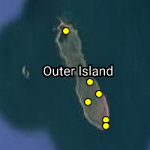

# Station Placement

Not all stations are created equal. Some will primarily achieve local objectives, others are part of regional networks, and others strategically placed at migration, or movement hotspots serve the collective needs of the entire network. At the end of the day, all stations work together to make up the Motus network and provide data to far more projects than your own. Motus is the ultimate, hands-on, community science project.

## Site Selection

Before deploying any stations, you need to know what the primary purpose of the station is. What works best for your region based on migratory flyways, topography and local infrastructure available, foraging locations, your goals, funding, the location of nearby stations.

Ideally, adjacent stations will complement one another; that is, they operate on similar frequencies and have antennas which point towards one another to provide detections of tagged animals as they pass between the stations. Multiple receivers can be employed to build a receiver ‘fence’ to detect any animals that may pass over a geographic area. Examples of these can be seen in the North-eastern US and along the North Sea of Europe. In Ontario, where many more stations are available, there is a grid of stations (or series of fences) to allow for better spatial resolution of movements. On study sites like Sable Island and Bon Portage Islands in Nova Scotia very small grids have been used to study local movements.

| 
 Receiver Fence (Panama Canal)
 | 
 Receiver Grid (Ontario)
 | 
 Local Array (Bon Portage Island)
 |
| :-------------------------------------------------------------------------------------------------: | :------------------------------------------------------------------------------------------: | :--------------------------------------------------------------------------------------------: |

When selecting a site, it’s important to consider how the landscape features will affect the range of your antennas. Generally, higher stations have a greater range and detection probability of passing animals, but have a more limited probability of detecting local movements (depending on the type of antenna that is attached). In most instances, stations should be placed in the highest elevation possible within the area of interest, ensuring there is a clear line of sight in each direction you wish to point the antennas. It’s also important to ensure there aren’t any obstructions immediately behind the antennas (within a few meters), especially metal surfaces like roofing.

CTT Nodes work in a similar fashion to other Motus stations, but at a much smaller scale. These devices are best suited for fine-scale studies. Read more about CTT Nodes here: [**CTT Nodes**](https://celltracktech.com/products/tag-system/ctt-node/)

## Antenna Interference

Antennas can receive interference if placed too close to metal objects or other antennas, or sources of electromagnetic noise (even air conditioners, generators, lawn mowers). Depending on frequency and location, radio interference from third-party broadcasters and cellular can also be problematic. Some online tools exist to locate licensed radio broadcasters by location ([**click here for Canadian stations**](https://tafl.jonathanmorgan.net)).

### Testing for antenna interference

One can conduct tests at a site prior to station setup, but none have been well tested. Below are some guidelines which may help identify noisy sites.

#### Measuring the noise floor

1. [**Download SDR Console from their website**](https://www.sdr-radio.com/download)
2. Plug the FUNcube dongle into your computer and run the SDR Console software.
3. Select the FUNcube dongle from the list of devices and tune it to the desired frequency.
4. Plug in an antenna and take measurements in all directions at or near the height where the antennas will be when the station is installed.
5. If you measure anything above **XX dB,** there may be a problematic noise source in that direction.

#### Measuring with a Motus receiver

1. Power on your receiver and plug in an antenna.
2. Point the antenna all direction at or near the height where the antennas will be when the station is installed, moving in a circle over a 5-minute period.
3. Download the data you just collected from your Motus receiver.
4. Open R and run the script provided here: **\[ LINK TO A SCRIPT ]**
5. If you're given a probability of less than 5%, you're good to go!


Use your receivers web interface to record the time you begin and end your measurements to get a more precise (and accurate) time.



It's best to use the exact same receiver you intend to be installing at that site.


###
