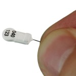
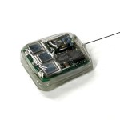
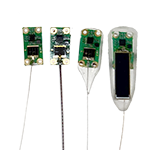
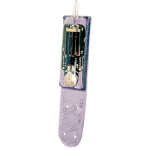

# Selecting and Purchasing Tags

## Contents

1. [Tag Selection](tag-selection.md#undefined)
   * [Detecting Movement](tag-selection.md#detecting-movement)
   * [Deploying tags within the Motus Network](tag-selection.md#deploying-tags-within-the-motus-network)
   * [Tag types](tag-selection.md#tag-types)
2. [Purchasing Tags](tag-selection.md#purchasing-tags)
   * [Avoiding tag aliasing](tag-selection.md#avoiding-tag-aliasing)

## Tag Selection

### Detecting Movement

As students of migration ecology, we ultimately seek the ability to know everything about all individuals at all times. Unfortunately, the technology required to do this for most flying migratory animals, particularly the smallest bodied ones, does not exist. Therefore, biologists have to use a combination of _complementary_ tools such as tracking-based geolocators, GPS and GSM, GPS and Geolocation data loggers, as well as isoptopic, genetic, and good old bird banding/ringing to discover the complete life histories of migratory animals. While often viewed as having competing value, these tools are undeniably complementary, and researchers need to employ the best tool for the job given the specific questions and study system in mind.

What is most unique about Motus is that it provides an opportunity to track the widest variety of the smallest animals possible, _today_, at local, regional, or hemispheric scales depending on the location and species in question. And best of all, almost anyone can get involved in one way or another – Motus is the ultimate hands-on community science project.

Another important differentiation between automated radio telemetry and other technologies available is that the temporal precision of the data can be much greater with radio telemetry as tags can repeat their signals as quickly as every 2 seconds. This extremely high temporal precision can allow for exceptionally detailed examinations of an animals behavior, movement patterns, direction and speed of flight.

The selection of specific tag type will largely depend on the spatial temporal scale of your study as well as your study species and geography.

### Deploying Tags within the Motus Network

The study location may largely determine what type of data you can expect, and which tags to use. When setting up your study, it’s important to consider how your tags may be detected by receivers in your area of interest. One tactic employed by the [Northeast Motus Collaboration](https://www.northeastmotus.com) is to build a receiver ‘fence’ over a geographic area such that any tagged animal passing through it will get detected. In Ontario, where many more stations are available, there is a grid of stations (or series of fences) to allow for better spatial resolution of movements. In the end, you will need to decide what works best for your region based on migratory flyways, foraging locations, your goals, funding, and the location of nearby receivers.

Go to the [receivers map](https://motus.org/data/receiversMap) to see all currently active receivers, what frequency they operate on and which type of tags they can detect. Keep in mind that these receivers have been deployed by various researchers who check their stations at different times. It’s helpful to check the ‘last data processed’ to get an idea of how often these stations get checked – you don’t want to be stuck waiting for a station you don’t own to get checked! In addition, stations that haven’t been checked in a long time (6 months to a year) may be in various states of disrepair so it’s also best not to rely on these stations before contacting the project manager.

### Tag Types

Motus supports two types of uniquely coded radio transmitters: NanoTags™ manufactured by [Lotek Wireless Inc](http://lotek.com), operating on frequencies 166.380 MHz (Western Hemisphere), 150.100 MHz (Europe), and 151.500 MHz (Australia), and LifeTag™, PowerTag™, and HybridTag™ manufactured by [Cellular Tracking Technologies](http://www.celltracktech.com) (CTT) operating on 434 MHz globally. The two tags use fundamentally different transmission and coding systems. Nanotags tags use amplitude modulation, or AM, whereas CTT tags us frequency modulation, or FM. Nanotags emit 4-bit pules that encode a unique ID in the time difference between these pulses, called Pulse-position Modulation (PPM). CTT use frequency-shift keying (FSK) which flips between two similar frequencies to encode a binary “1” or “0”, with a total of 64 of these bits per transmission.

The distribution of stations listening for either tag is not uniform, so collaborators should consult the [Motus Receiver Map](https://motus.org/data/receiversMap/) to confirm which frequency stations are operating on throughout the network. When communicating with Lotek or CTT, be sure to explicitly state that you want your tags/system to be compatible with Motus.

It is simple to outfit some Motus receivers to be dual-mode in order to “listen” for both of these tag types. We recommend that stations be configured this way whenever possible in order to support the greatest number of researchers.

There is a lot of detail about these two tags that can’t all be explored here, but the table below summarizes the major differences. [Contact Motus](https://motus.org/contact), or the tag providers above for more information.

<table><thead><tr><th width="152"></th><th></th><th></th><th></th><th></th><th></th></tr></thead><tbody><tr><td></td><td><a href="https://www.lotek.com/products/nanotags/"><strong>Lotek Nanotag</strong> </a></td><td><a href="https://www.lotek.com/products/solar-nanotags-coded-vhf-for-birds/"><strong>Lotek Nanotag Solar</strong> </a></td><td><a href="https://celltracktech.com/pages/lifetag"><strong>CTT LifeTags</strong> </a></td><td><a href="https://celltracktech.com/pages/powertag"><strong>CTT PowerTags</strong> </a></td><td><a href="https://celltracktech.com/pages/hybridtag"><strong>CTT HybridTags</strong> </a></td></tr><tr><td><strong>Manufacturer</strong></td><td><strong>Lotek</strong></td><td><strong>Lotek</strong></td><td><strong>CTT</strong></td><td><strong>CTT</strong></td><td><strong>CTT</strong></td></tr><tr><td>Frequency</td><td>150.1, 151.5, or 166.380 MHz</td><td>150.1, 151.5, or 166.38 MHz</td><td>434 MHz</td><td>434 MHz</td><td>434 MHz</td></tr><tr><td>Lifespan</td><td>Long (12 – 4000 d)</td><td>Unlimited</td><td>Unlimited</td><td>Long (180 d to yrs)</td><td>Unlimited</td></tr><tr><td>Daily active period</td><td>24/7 or alternate 12-hour on/off</td><td>24/7 (battery and solar powered)</td><td>Needs sufficient light; works in low light conditions and indirect light.</td><td>24/7</td><td>24/7 (battery and solar powered)</td></tr><tr><td>Weight</td><td>0.13 g – 12.4 g</td><td>1.4 g and up</td><td>0.45 g and up</td><td>0.35 g and up</td><td>0.65 g and up</td></tr><tr><td>Smallest bird (%3 body weight)</td><td>5.0 g</td><td>46.7 g</td><td>14.7 g</td><td>11.0 g</td><td>21.0 g</td></tr><tr><td>Possible number of unique tags</td><td>>36,000*</td><td>>36,000*</td><td>~4 billion</td><td>~4 billion</td><td>~4 billion</td></tr><tr><td>Burst intervals</td><td>~3-40 seconds</td><td>?</td><td>2 seconds </td><td>2-15 seconds</td><td>2-15 seconds</td></tr><tr><td>Current number of compatible Motus Stations</td><td>
3600+

<a href="https://motus.org/data/receiversMap/">See receiver map for distribution</a>
</td><td>
3600+

<a href="https://motus.org/data/receiversMap/">See receiver map for distribution</a>
</td><td>
1000+

<a href="https://motus.org/data/receiversMap/">See receiver map for distribution</a>
</td><td>
487+

<a href="https://motus.org/data/receiversMap/">See receiver map for distribution</a>
</td><td>
487+

<a href="https://motus.org/data/receiversMap/">See receiver map for distribution</a>
</td></tr><tr><td>Compatible with CTT Receivers</td><td>SensorStation with FUNcube Dongle only</td><td>SensorStation with FUNcube Dongle only</td><td>Yes</td><td>Yes</td><td>Yes</td></tr><tr><td>Compatible with Lotek Receivers</td><td>Yes</td><td>Yes</td><td>No</td><td>No</td><td>No</td></tr><tr><td>Compatible with SensorGnome Receivers</td><td>With FUNcube dongle only</td><td>With FUNcube dongle only</td><td>With CTT Motus Adapter only</td><td>With CTT Motus Adapter only</td><td>With CTT Motus Adapter only</td></tr><tr><td>Price</td><td>~$200 USD</td><td>~$200 USD</td><td>~$200 USD</td><td>~$200 USD</td><td>~$250 USD</td></tr><tr><td>Discount</td><td>Contact Lotek</td><td>Contact Lotek</td><td>
5% for 20+

10% for 30+
</td><td>
5% for 20+

10% for 30+
</td><td>
5% for 20+

10% for 30+
</td></tr></tbody></table>

**\* This number is calculated by multiplying the number of unique ID’s emitted by Lotek tags (517) with the number of unique burst intervals available (70). These burst intervals range from 2.3 to 39.7 seconds, which corresponds to the number of primes between 23 and 397 such that no two burst intervals overlap with one another.**\

## **Purchasing Tags**

Specifications for Lotek bird and bat NanoTags can be viewed on the [Lotek Website](http://www.lotek.com/avian-nanotags.htm). Specifications for CTT LifeTags™ and PowerTags™ can be found on the [Cellular Tracking Technologies website](https://celltracktech.com/). When ordering tags, provide the Motus Project ID they are to be registered.&#x20;

There are several important criteria to consider prior to ordering tags:

* **Frequency:** Lotek NanoTags operate on 166.380 MHz (Western Hemisphere), 150.100 MHz (Europe), and 151.500 MHz (Australia). CTT Power and LifeTags operate on 434 MHz (Worldwide). Consult the receiver map to see the distribution of stations operating on the different frequencies.
* **Size:** Minimize weight of the tag + attachment materials.
* **Operational life:** Battery size and burst interval (amount of time between consecutive pulses) influence the operational life of a tag. Bigger batteries have a longer lifespan, but increased weight. A longer burst interval results in a longer lifespan but reduced detection rate.
* **Burst interval:** Although a longer burst interval provides a longer operational life, increasing the burst interval reduces the number of data points attainable within a given time period.
* **Attachment method:** Modifications to tags (e.g. tubes) may be necessary for certain attachment methods.


Always double-check that your tags have been registered to the correct Motus project after your tags have shipped. If you do not have a Motus project, please [**Create or Join a project**](../project-management/introduction.md#join-a-project) before ordering your tags.


### Avoiding Tag Aliasing

Aliasing can occur when multiple tags emit a signal in the same place at the same time. Sometimes these interacting signals can produce a pattern which match a different tag that is not actually present. This is due to the nature of how the tag ID is encoded in the signal. Although the parameters used to define tag IDs are quite stringent – making aliasing only an issue in specific conditions – aliasing can still cause false detections of your tags as well as tags from other projects. Removing them usually involves additional validation steps which can be difficult and time consuming for the researcher. One method to help mitigate tag aliasing is to select tags with longer burst intervals as this reduces the chances of two signals overlapping.

[**Read more about tag aliasing here**](tag-aliasing.md#how-to-avoid-tag-aliasing-1)
